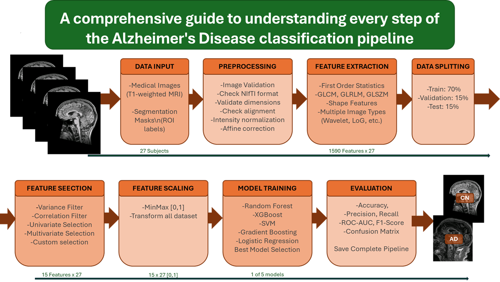

# Radiomics Pipeline for Alzheimer's Disease Classification


A robust, production-ready pipeline for medical image analysis using radiomics features and machine learning. This pipeline is designed for clinical technicians and researchers to classify Alzheimer's Disease (AD) vs Cognitively Normal (CN) subjects.

## 🌟 Key Features

- **Advanced Preprocessing**: Automatic NIfTI validation, intensity normalization, and image alignment
- **Comprehensive Feature Extraction**: 1000+ radiomics features from multiple image types
- **Multi-method Feature Selection**: 
  - Univariate filtering (correlation, mutual information)
  - Multivariate selection (RFE, Boruta)
  - Variance thresholding
- **Multiple ML Models**: Random Forest, XGBoost, SVM, Logistic Regression, Gradient Boosting
- **Production-ready**: Complete pipeline persistence, new image prediction
- **GUI-ready**: Modular architecture prepared for graphical interface integration

## 💡 Why this project?

This project was built to demonstrate my ability to design a production-ready
machine learning pipeline for medical imaging. It showcases skills in:

- data preprocessing for neuroimaging (NIfTI, affine, normalization)
- radiomics feature engineering
- model selection and evaluation for clinical classification
- building modular, extensible, production-grade architectures

## 🧠 Skills Demonstrated
- Data preprocessing and normalization for 3D medical images
- Advanced feature engineering (PyRadiomics)
- Multi-stage ML pipelines
- Hyperparameter optimization
- Model evaluation for imbalanced data
- Production-ready architecture
- CLI tool design
- Logging and error handling


## 📁 Project Structure

```
radiomics_pipeline/
├── config.py                 # Configuration management
├── preprocessing.py          # Image preprocessing module
├── feature_extraction.py     # Radiomics feature extraction
├── feature_selection.py      # Advanced feature selection
├── model_training.py         # Multi-model training
├── pipeline.py              # Complete pipeline integration
├── predict.py               # Prediction on new images
├── main.py                  # Main executable script
├── utils/
│   └── metrics.py           # Evaluation and visualization utilities
├── requirements.txt         # Python dependencies
├── models/                  # Saved models directory
├── results/                 # Results and reports
├── logs/                    # Logging files
└── data/                    # Dataset directory
```

## 🛠️ Built With
- Python
- PyRadiomics
- Scikit-learn
- XGBoost
- NumPy & SciPy
- Nibabel
- Matplotlib / Seaborn


## 📋 Requirements

- Python 3.8+
- See `requirements.txt` for full dependencies

## 🚀 Installation

```bash
# Clone the repository
git clone https://github.com/JimmyBelt/Alzheimer-s-Disease-classification-pipeline.git
cd radiomics_pipeline

# Create virtual environment
python -m venv venv
source venv/bin/activate  # On Windows: venv\Scripts\activate

# Install dependencies
pip install -r requirements.txt

# Optional: Install Boruta for advanced feature selection
pip install boruta
```

## 📊 Expected Data Structure and Workflow

```
dataset/
├── AD/                      # Alzheimer's Disease subjects
│   ├── subject_001/
│   │   ├── T1/
│   │   │   └── T1.nii.gz
│   │   └── label/
│   │       └── label.nii.gz
│   ├── subject_002/
│   └── ...
└── CN/                      # Cognitively Normal subjects
    ├── subject_101/
    │   ├── T1/
    │   │   └── T1.nii.gz
    │   └── label/
    │       └── label.nii.gz
    └── ...
```




## 🎯 Usage

### 1. Training a Complete Pipeline

```bash
# Train with all enabled models
python main.py --mode train --data /path/to/dataset

# Quick training (reduced hyperparameter search)
python main.py --mode train --data /path/to/dataset --quick

# Train specific models only
python main.py --mode train --data /path/to/dataset --models random_forest xgboost

# Custom output directory
python main.py --mode train --data /path/to/dataset --output ./my_results
```

### 2. Predicting on New Images

```bash
# Single image prediction
python main.py --mode predict \
    --pipeline models/pipeline.pkl \
    --image /path/to/image.nii.gz \
    --mask /path/to/mask.nii.gz

# Using the prediction module directly
python predict.py \
    --pipeline models/pipeline.pkl \
    --image /path/to/image.nii.gz \
    --mask /path/to/mask.nii.gz \
    --output prediction_result.json

# Batch prediction on directory
python predict.py \
    --pipeline models/pipeline.pkl \
    --directory /path/to/test/dataset \
    --output batch_predictions.csv \
    --visualize
```

### 3. Evaluating Existing Pipeline

```bash
python main.py --mode evaluate \
    --pipeline models/pipeline.pkl \
    --data /path/to/test/dataset
```

### 4. Feature Extraction Only

```bash
python main.py --mode extract \
    --data /path/to/dataset \
    --output ./features
```

## 🔧 Configuration

Edit `config.py` to customize:

### Preprocessing Settings
```python
PREPROCESSING = {
    'validate_nifti': True,
    'fix_affine': True,
    'intensity_normalization': True,
    'check_spacing': True,
    'check_orientation': True
}
```

### Feature Selection Settings
```python
FEATURE_SELECTION = {
    'correlation_threshold': 0.8,
    'univariate_method': 'mutual_info',
    'univariate_k': 50,
    'use_rfe': True,
    'rfe_n_features': 20,
    'use_boruta': True,
    'final_k_features': 15
}
```

### Model Configuration
```python
MODELS = {
    'random_forest': {
        'enabled': True,
        'param_grid': {
            'n_estimators': [50, 100, 200],
            'max_depth': [3, 5, 7, 10],
            ...
        }
    },
    'xgboost': {
        'enabled': True,
        ...
    }
}
```

## 📈 Pipeline Workflow

1. **Feature Extraction**
   - Load and validate NIfTI images
   - Apply preprocessing (intensity normalization, affine correction)
   - Extract 1000+ radiomics features using PyRadiomics
   - Features from multiple image types (Original, Wavelet, LoG, etc.)

2. **Feature Selection**
   - Remove low variance features
   - Remove correlated features (univariate correlation > 0.8)
   - Univariate selection (mutual information, f_classif, chi2)
   - Multivariate selection (RFE with Random Forest)
   - Optional: Boruta algorithm for all-relevant feature selection
   - Final selection based on importance ranking

3. **Model Training**
   - Data splitting (train/validation/test)
   - Feature scaling (MinMax, Standard, or Robust)
   - Grid search with cross-validation for each model
   - Multiple models: RF, XGBoost, SVM, LogReg, GradientBoosting
   - Best model selection based on ROC-AUC

4. **Evaluation**
   - Comprehensive metrics (Accuracy, Precision, Recall, F1, ROC-AUC)
   - Confusion matrices
   - ROC and Precision-Recall curves
   - Feature importance analysis
   - Overfitting analysis

5. **Deployment**
   - Complete pipeline serialization
   - Prediction on new images
   - Batch processing capabilities

## 📊 Output Files

After training, the pipeline generates:

```
results/
├── raw_features.csv                 # All extracted features
├── model_comparison.csv             # Performance comparison
├── training_report.txt              # Detailed training report
├── feature_selection_summary.png    # Feature selection visualization
├── roc_curves.png                   # ROC curves for all models
├── confusion_matrix.png             # Best model confusion matrix
├── feature_importances.png          # Feature importance plot
└── pipeline_report.txt              # Complete pipeline summary

models/
├── pipeline.pkl                     # Complete pipeline (all models)
├── pipeline_metadata.json           # Pipeline information
└── best_model_*.pkl                 # Individual model files
```

## 🔬 Python API Usage

```python
from config import Config
from pipeline import RadiomicsPipeline
from pathlib import Path

# Initialize pipeline
config = Config()
pipeline = RadiomicsPipeline(config)

# Run complete training
results = pipeline.run_complete_pipeline(Path('/path/to/dataset'))

# Save pipeline
pipeline.save_pipeline()

# Predict on new image
result = pipeline.predict_new_image(
    Path('new_image.nii.gz'),
    Path('new_mask.nii.gz')
)
print(f"Prediction: {result['prediction_label']}")
print(f"Confidence: {result['confidence']:.2%}")
```

## 🎨 Preparing for GUI Integration

The modular architecture is designed for easy GUI integration:

```python
# Example GUI integration pseudocode
class RadiomicsGUI:
    def __init__(self):
        self.pipeline = RadiomicsPipeline()
    
    def on_train_button_click(self):
        dataset_path = self.get_dataset_path_from_dialog()
        # Run in separate thread to avoid blocking UI
        self.pipeline.run_complete_pipeline(dataset_path)
    
    def on_predict_button_click(self):
        image_path = self.get_file_from_dialog()
        mask_path = self.get_file_from_dialog()
        result = self.pipeline.predict_new_image(image_path, mask_path)
        self.display_result(result)
```

## 🐛 Troubleshooting

### Common Issues

1. **NIfTI Validation Errors**
   - Solution: Enable `fix_affine: True` in config
   - Pipeline automatically fixes non-orthonormal affine matrices

2. **Memory Issues with Large Datasets**
   - Solution: Process in batches or reduce feature extraction settings
   - Consider using `quick` mode for initial testing

3. **Boruta Installation Issues**
   - Boruta is optional but recommended
   - If unavailable, set `use_boruta: False` in config

4. **XGBoost Not Found**
   - Install: `pip install xgboost`
   - Or disable in config: `MODELS['xgboost']['enabled'] = False`

## 📝 Logging

All operations are logged to:
- Console (real-time feedback)
- File: `logs/pipeline.log`

Configure logging level in `config.py`:
```python
LOGGING = {
    'level': 'INFO',  # DEBUG, INFO, WARNING, ERROR
    ...
}
```

## 🔍 Feature Extraction Details

The pipeline extracts features from:

**Image Types:**
- Original
- Wavelet decomposition
- Laplacian of Gaussian (LoG)
- Square, Square Root
- Logarithm, Exponential
- Gradient
- Local Binary Pattern (LBP-3D)

**Feature Classes:**
- First Order Statistics
- Gray Level Co-occurrence Matrix (GLCM)
- Gray Level Run Length Matrix (GLRLM)
- Gray Level Size Zone Matrix (GLSZM)
- Gray Level Dependence Matrix (GLDM)
- Neighbourhood Gray Tone Difference Matrix (NGTDM)
- Shape features

## 📚 References

- PyRadiomics: https://pyradiomics.readthedocs.io/
- Boruta Algorithm: Kursa & Rudnicki (2010)
- Radiomics in Medical Imaging: Gillies et al. (2016)

## 🤝 Contributing

This pipeline is designed for clinical use. Contributions welcome:
- Bug fixes
- New feature selection methods
- Additional preprocessing steps
- GUI implementation
- Documentation improvements

## 📄 License

This project is licensed under the MIT License – see the [LICENSE](./LICENSE) file for details.


## 👥 Author

Jaime Beltrán Sánchez

Thanks to Blanca Rodríguez González


## 📧 Contact

For questions or support: jaime120901@gmail.com
Linkenidn: www.linkedin.com/in/jaimebeltransz


---

**Note**: This pipeline is for research purposes. Clinical use requires proper validation and regulatory approval.